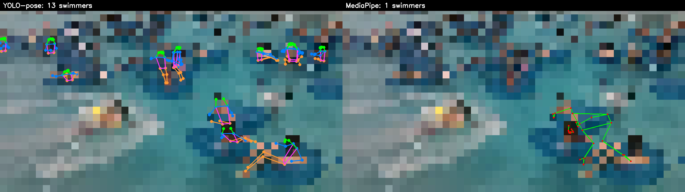
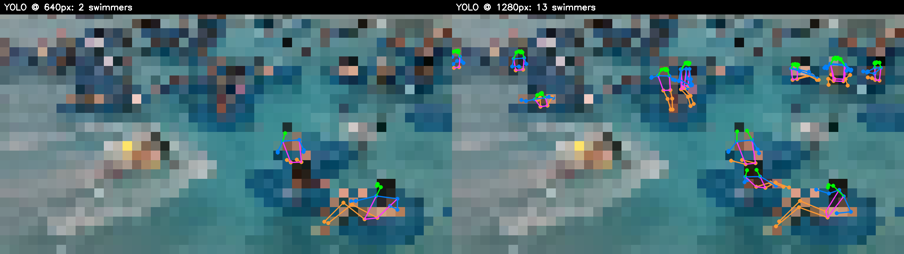

# Hydro-Knight

A pose-based **anomaly-detection** system for swimming-pool safety. It watches pool
footage, tracks individual swimmers, and flags potential drowning events — not by
classifying drowning types, but by learning what *normal* swimming looks like and
flagging deviations (the right framing when real positives are rare).

The pipeline turns video into per-swimmer keypoint time-series, then scores those
sequences for anomalies (not-surfacing, prolonged face-down, erratic flailing).
Data is **manifest-driven**: the repo commits source URLs + annotations, never raw
video (copyright, and footage shows identifiable people — often minors).

See [PLAN.md](PLAN.md) for the full architecture and build progression.

---

## Engineering decisions

### Choosing the pose backend: YOLO-pose vs MediaPipe (and the resolution that actually mattered)

The entire architecture rests on one assumption: that an off-the-shelf pose
estimator can reliably find swimmers in real pool footage. Before building
anything on top of it, we tested that assumption directly — running both
**YOLO-pose** (Ultralytics) and **MediaPipe** on identical frames from real clips.

> Figures below are **deliberately pixelated** — backgrounds are blurred to
> unrecognizability and only the extracted skeletons are drawn crisply. This keeps
> the repo consistent with the project's no-identifiable-footage policy.

**Finding 1 — Model: YOLO decisively beats MediaPipe.** On crowded pool scenes,
MediaPipe found 0–1 swimmers per frame (it's effectively single-person); YOLO found
many. Same frame, same settings:

**Finding 2 — Resolution was the real lever.** The bigger surprise: input
resolution mattered *more* than model choice. YOLO's default 640px input shrinks
distant swimmers below detectability. Running the same frame at 1280px recovered
3–6× more swimmers — a near-free config change:

**Detection counts across scene types** (swimmers found per sampled frame):

| Scene | YOLO @640 | YOLO @1280 | MediaPipe |
|---|---|---|---|
| Crowded wavepool | 2–4 | **7–13** | 0–1 |
| Sparse resort pool | 0–1 | 0–1 | 0 |

**Decisions banked:**
- **YOLO-pose is the backend** (its built-in tracker may also subsume the separate tracking stage).
- **Run inference at ≥1280px** — the single highest-leverage setting for small/distant swimmers.
- **The pose approach is viable, with conditions:** it needs high-resolution inference and *populated* footage. An empty pool yields no poses, so data priority shifted toward busy-pool sources (lap sessions, swim practice) over clean-but-empty resort cams.
- **Both backends share the core risk:** trained on land-based upright humans, both degrade on prone/submerged swimmers — the next thing to validate, and a likely candidate for swim-specific fine-tuning later.

Reproduce the figures: `PYTHONPATH=src .venv/bin/python scripts/make_pose_figure.py`
(reads a local clip; the spike tool is [`pose_spike.py`](src/aqua_anomaly/preprocess/pose_spike.py)).
